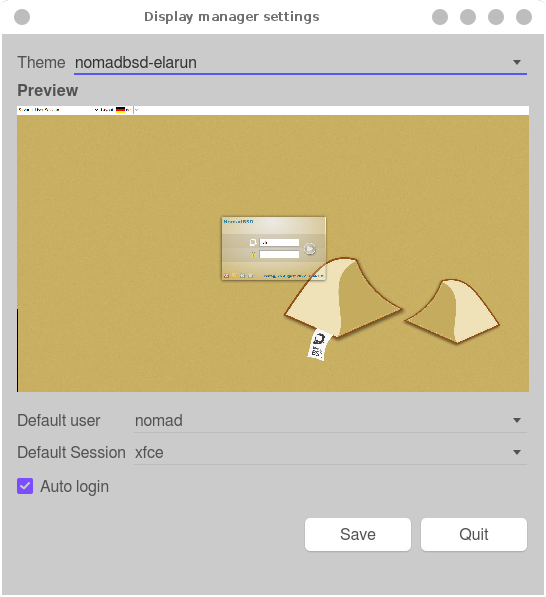

# NomadBSD Handbooklet

## Content
1. [Intro](#intro)
1. [Installation](#installation)
	1. [Choosing a USB flash drive](#choosemedia)
	1. [Downloading and writing the image](#download)
1. [The NomadBSD setup](#firstboot)
1. [Overview](#overview)
1. [Key bindings](#keybindings)
	1. [Global keybindings](#globalkeybindings)
	1. [Terminal keybindings](#terminalkeybindings)
1. [Enable/Disable desktop components, and auto-start programs](#autostart)
1. [Adding applications to the *plank* panel](#plank)
1. [Display manager settings: Auto login, default user, and theme](#dmconfig)
1. [Adding a preconfigured user account](#adduser)
1. [Filesystem](#filesystems)
	1. [Automount](#automount)
	1. [Extending filesystem support](#fssupport)
		1. [exFat](#exfat)
		1. [BTRFS and XFS](#linuxfs)
1. [Networking](#networking)
	1. [Wireless Networking](#wifi)
1. [Installing software packages](#instpkg)
1. [Installing Linux® browsers for watching *Netflix*, *Prime Video*, etc.](#linuxbrowser)
1. [Graphics](#graphics)
	1. [Multihead setup](#multihead)
	1. [Changing display settings](#displaysettings)
1. [Sound](#sound)
	1. [Selecting the default audio device](#defaultaudio)
1. [Using an alternative window manager](#altwm)
1. [Advanced Topics](#advanced)
	1. [Resetting NomadBSD](#reset)
		1. [Limitations](#reset_limits)
	1. [Disabling the automatic graphics driver setup](#disableinitgfx)
	1. [Installing NomadBSD on a hard disk](#hddinstall)
	1. [Running NomadBSD in VirtualBox™](#vbox)
	1. [Installing Linux® packages](#linuxpkg)
1. [Troubleshooting](#troubleshooting)
	1. [Errata](#errata)
	1. [Boot process](#ts_boot)
		1. [The boot process stops at the *mountroot* prompt](#ts_mountroot)
	1. [Graphics](#ts_graphics)
		1. [ATI/AMD](#ts_ati_amd)
		1. [NVIDIA](#ts_nvidia)
		1. [Distorted/squished EFI framebuffer screen](#efifb)
		1. [Hybrid Combination/Switchable Graphics](#hybridgfx)
		

## Intro

NomadBSD is a 64bit live system for USB flash drives, based on
FreeBSD®. Together with automatic hardware detection and setup, it
is configured to be used as a desktop system that works out of the box, but
can also be used for data recovery, for educational purposes, or to test
FreeBSD®'s hardware compatibility.

## Installation

### Choosing a USB flash drive
NomadBSD performs well on USB 2.X flash drives, but writing many small files
can be very slow. To improve performance, you should consider using a USB 3.X
flash drive even on a USB 2.X port, as they tend to be faster. See
[USB 3.0 Flash Drive Roundup](https://www.anandtech.com/show/4523/usb-30-flash-drive-roundup/6). Do not use cheap no-name thumb drives they sell at super markets
and drug stores. These drives are very slow and unreliable.

### Downloading and writing the image
Instructions for writing the image to a flash drive from different operating
systems can be found [here](http://nomadbsd.org/download.html).

## The NomadBSD setup
When you boot NomadBSD for the first time, it will run the setup wizard which
allows you to set your locale, timezone, keyboard settings, password,
encryption, and default applications. The setup creates a new partition for
the `/home` directory which uses the remaining space on the storage device.
Depending on the size, creating the file system can take several minutes.

## Overview

1. [Openbox](https://freshports/x11-wm/openbox) menu. You can reach it by
	pressing the Windows® key (or Super key)/⌘ key
	(Mac®), or by right-clicking on the background image
	(root window).
2. [DSBBatmon](https://freshports.org/sysutils/dsbbatmon). By hovering over
	the icon you can see the battery's current status and charge. Clicking
	on it brings up the configuration menu.
3. [DSBMixer](https://freshports.org/audio/dsbmixer). By hovering over the
	icon you can see the current volume of the master
	channel. Using the mouse wheel on it lets you change the
	master volume. Clicking on it brings up the main window of
	[DSBMixer](http://freshports.org/audio/dsbmixer).
4. [DSBMC](https://freshports.org/sysutils/dsbmc). Clicking on the icon brings
	up the main window in which you	can see all the mountable storage devices
	attached to the system. Use	the context menu of the device icons to select
	an action (un/mounting,	opening, playing, ejecting) or double click to
	mount and open the device in your default file manager. You can use the
	preferences menu to change the file manager, autoplay setting, and
	multimedia programs.
5. [NetworkMgr](https://www.freshports.org/net-mgmt/networkmgr). Clicking on the
	icon shows the menu from which you can connect to wireless networks.
6. Date and time. Clicking in that area brings up a calendar.

## Key bindings

### Global keybindings
<table style="width:100%; table-layout:fixed">
	<tr>
		<th>Keys</th>
		<th>Function</th>
	</tr>
	<tr>
		<td>Alt+F2</td>
		<td>Open DSBExec to execute a command.</td>
	</tr>
	<tr>
		<td>Ctrl+Alt+L</td>
		<td>Lock the screen.</td>
	</tr>
	<tr>
		<td>Ctrl+Space</td>
		<td>Open <a href="https://www.freshports.org/x11/dmenu">dmenu-run</a>
		to execute a command.</td>
	</tr>
	<tr>
		<td>Print</td>
		<td>Open XFCE 4 screenshooter.</td>
	</tr>
</table>

### Terminal keybindings
<table style="width:100%; table-layout:fixed">
	<tr>
		<th>Keys</th>
		<th>Function</th>
	</tr>
	<tr>
		<td>Ctrl++</td>
		<td>Increase font size</td>
	</tr>
	<tr>
		<td>Ctrl+-</td>
		<td>Decrease font size</td>
	</tr>
	<tr>
		<td>Shift+Ctrl+C</td>
		<td>Copy selected text</td>
	</tr>
	<tr>
		<td>Shift+Ctrl+V</td>
		<td>Paste copied text</td>
	</tr>
	<tr>
		<td>Ctrl+Shift+T</td>
		<td>Open a new tab</td>
	</tr>
	<tr>
		<td>Ctrl+Shift+W</td>
		<td>Close current tab</td>
	</tr>
	<tr>
		<td>Alt+Left cursor</td>
		<td>Previous tab</td>
	</tr>
	<tr>
		<td>Alt+Right cursor</td>
		<td>Next tab</td>
	</tr>
	<tr>
		<td>Alt+[1-9]</td>
		<td>Switch to tab N (1-9)</td>
	</tr>
	<tr>
		<td>Ctrl+Shift+S</td>
		<td>Toggle scrollbar</td>
	</tr>
	<tr>
		<td>Ctrl+Shift+Left mouse button</td>
		<td>Open link</td>
	</tr>
	<tr>
		<td>F11</td>
		<td>Fullscreen</td>
	</tr>
	<tr>
		<td>Shift+PageUp</td>
		<td>Scroll up one page</td>
	</tr>
	<tr>
		<td>Shift+PageDown</td>
		<td>Scroll down on page</td>
	</tr>
	<tr>
		<td>Ctrl+Shift+Up</td>
		<td>Scroll up one line</td>
	</tr>
	<tr>
		<td>Ctrl+Shift+Down</td>
		<td>Scroll down one line</td>
	</tr>
</table>

## Enable/Disable desktop components, and auto-start programs
The program [DSBAutostart](http://freshports.org/sysutils/dsbautostart)
([Openbox menu](#overview) → *Settings* → *Autostart Settings*) allows you to control which
programs are automatically executed when the graphical interface starts.
Further, it allows you to enable/disable some components of the NomadBSD
desktop. The changes take place after logging out and in again.

## Adding applications to the *plank* panel
Open your preferred graphical file manager, and navigate to `/usr/local/share/applications`.
You can also get there by clicking the shortcut *Applications* on the side pane.
Use Drag&Drop to add application icons to the *plank* panel.

## Display manager settings: Auto login, default user, and theme
The display manager, [SLiM](https://freshports.org/x11/slim), used by NomadBSD
is configured to automatically log in the default user *nomad*. The program
*nomadbsd-dmconfig* ([Openbox menu](#overview) → *Settings* → *Display manager settings*)
allows you to change/disable the default user, and to enable/disable auto login.
Furthermore, it lets you change the theme. If you want to add a new theme, copy
the theme's directory to */usr/local/share/slim/themes/*. To see a preview
in *nomadbsd-dmconfig* copy a screenshot of the login screen to
*/usr/local/share/slim/themes/your-theme-name/preview.png*.

## Adding a preconfigured user account
If you want to add a further preconfigured user account use
*nomadbsd-adduser* ([Openbox menu](#overview) → *System* → *Add user*).
Since NomadBSD is configured to automatically log in the user *nomad* you
need to change that behaviour in order to be able to log in as another
user. See [*nomadbsd-dmconfig*](#dmconfig).

## Filesystems
NomadBSD comes with a bunch of pre-installed filesystems (CD9660, FAT, HFS+,
NTFS, Ext2/3/4). You can mount storage devices via
[DSBMC](http://freshports.org/sysutils/dsbmc) (see [Overview](#overview)),
which is a graphical client for [DSBMD](http://freshports.org/sysutils/dsbmd).

### Automount
Execute the command `dsbmc-cli -a` to automount all currently connected
storage devices, and to enable automounting on devices attached later to the
system. To start this command automatically on session start, open
[DSBAutostart](#autostart), and add a new entry for the above command.

### Extending filesystem support
The following subsections describe how to extend the filesystems support.
Rebooting the system, or restarting
[DSBMD](http://freshports.org/sysutils/dsbmd) is not necessary.

#### ExFat
Unfortunately,
[sysutils/fusefs-exfat](https://freshports.org/sysutils/fusefs-exfat)
requires a license from Microsoft®, and so it can't be
pre-installed. You have to build it yourself by using the ports:

	# pkg install autoconf automake
	# svnlite co https://svn.freebsd.org/ports/head/Mk /usr/ports/Mk
	# svnlite co https://svn.freebsd.org/ports/head/Templates /usr/ports/Templates
	# svnlite co https://svn.freebsd.org/ports/head/sysutils/fusefs-exfat /tmp/fusefs-exfat
	# cd /tmp/fusefs-exfat
	# make DISTDIR=/tmp install

or the [Git repo](https://github.com/relan/exfat.git):

	# pkg install autoconf automake
	# git clone https://github.com/relan/exfat.git
	# cd exfat
	# autoreconf --install
	# ./configure
	# make && make install

#### BTRFS and XFS
Install the package
[fusefs-lkl](https://www.freshports.org/sysutils/fusefs-lkl) for BTRFS
and XFS support.

	# pkg install fusefs-lkl

## Networking

### Wireless Networking
The program [networkmgr](http://freshports.org/net-mgmt/networkmgr), which
runs in the tray, allows you to connect to wireless networks.

## Installing software packages

You can install and upgrade software packages with
[OctoPkg](https://www.freshports.org/ports-mgmt/octopkg)
([Openbox menu](#overview) → *System* → *OctoPkg*) which is a graphical
front-end to FreeBSD's [pkg](https://www.freebsd.org/doc/handbook/pkgng-intro.html).

## Installing Linux® browsers for watching *Netflix*, *Prime Video*, etc.
The program *lbi-gui* ([Openbox menu](#overview) → *Network* → *Linux Browser Installer GUI*)
allows you to install [*Widevine*](https://en.wikipedia.org/wiki/Widevine) capable Linux versions of the
[Chromium](https://www.chromium.org/Home) and [Brave](https://brave.com/)
browser.

## Graphics

### Multihead setup
By default, NomadBSD enables all connected outputs (monitors). The tool
[ArandR](http://freshports.org/x11/arandr)
([Openbox menu](#overview)→ *Settings* → *ArandR*) allows you to configure
the position, resolution, etc. of your monitors. Save your changes to
`~/.screenlayout/default.sh` which is automatically executed on session start.

### Changing display settings
The program ([Openbox menu](#overview)→ *Settings* → *Display Settings*)
allows you to change the brightness, gamma, screen mode, display power management
(DPMS) settings, etc.

## Sound

### Selecting the default audio device
Right-click on the speaker/volume indicator icon in the panel, and choose
*Preferences* from the menu. In the preferences window go to the
*Default device* tab, select the sound card/device, and click on *Ok*. 
In order to take effect make sure to restart your audio application(s).

## Using an alternative window manager
You can install different window managers and desktop environments on
NomadBSD. Select the one you want to start by pressing `<F1>` in the
graphical login manager ([SLiM](https://freshports.org/x11/slim)).

## Advanced Topics

### Resetting NomadBSD

If you are a tester, or your experiments with the systems left a total mess,
you might want to reset NomadBSD.

- - -

**Warning:** The reset will delete `/home`, `/private`, `/etc`,
`/var`, `/root`, and `/usr.local.etc`. Make a backup if there are any files
you want to keep.

- - -

You can reset NomadBSD as follows:

1. Boot into single-user mode by (re)booting and choosing `2` in the boot
menu.
2. Execute `/usr/libexec/nomadbsd-reset`

After rebooting you'll be greeted by the setup again.

#### Limitations
If you have modified or deleted system files from directory trees other than
`/home`, `/private`, `/etc`, `/var`, `/root`, `/tmp`, and `/usr.local.etc`,
you might not be able to cleanly reset NomadBSD.

### Disabling the automatic graphics driver setup
If you want to create your own graphics driver settings, you can disable
`initgfx` by adding

`initgfx_enable="NO"` to `/etc/rc.conf`.

### Installing NomadBSD on a hard disk
Start [Openbox menu](#overview) → *System* → *NomadBSD Installer* and
follow the instructions.

- - -

**Note:** The NomadBSD installer will use the entire disk. Installing to a
single partition is currently not possible.

- - -

### Running NomadBSD in Virtualbox™
1. [Download and extract](http://nomadbsd.org/download.html) an image you intend to run.
2. NomadBSD will use the remaining space on a USB flash drive for its `/home`
partition, but since we intend to run it from an image file, we increase the
(potential) size of the image as follows:
`truncate -s +4G nomadbsd-x.y.z.img`. If you need more or less extra space, change the
`-s` parameter accordingly.
3. Create a vmdk file: `VBoxManage internalcommands createrawvmdk -filename ~/nomadbsd.vmdk -rawdisk /full/path/to/nomadbsd-x.y.z.img`
4. Start VirtualBox™, and create a new virtual machine. Select
*Use an existing virtual hard disk file* in the *Hard disk* settings, and
choose *nomadbsd.vmdk* which we created in 3.

5. Go to *Settings* → *Display* and set the video memory to 128MB or more.
6. Go to *Settings* → *System* → *Processor* and set the number of
processors to 2.

## Installing Linux® packages

Before you can install Linux® packages it is necessary to enable
<a href="https://www.freebsd.org/doc/handbook/linuxemu-lbc-install.html">Linux® binary compatibility</a>.
Let's say you want to install <a href="https://freshports.org/editors/linux-sublime">linux-sublime</a>
you can proceed as follows:

	# sysrc linux_enable=YES
	# service abi start
	# pkg install linux-sublime

## Troubleshooting

### Errata
If you experience any problems, consult the
<strike>[NomadBSD Errata](http://nomadbsd.org/download/errata-1.2.txt)</strike> first.

### Boot problems

#### The boot process stops at the *mountroot* prompt
If you are using a USB 3.X port, try to use a USB 2.X port instead.

### Graphics

#### ATI/AMD
If you are booting a system with ATI/AMD graphics via UEFI, you might
experience some problems. Due to
[a conflict with the EFI framebuffer](https://wiki.freebsd.org/Graphics#AMD_Graphics),
NomadBSD might crash or hang when the graphics driver gets loaded, or it just
isn't able to start the X window system.

Try the following workaround:

1. (Re)boot and enter the boot submenu `Boot Options` (`6`).
2. Change `Disable syscons` to `On` by pressing the key matching the item
number.
3. Go back to main menu, and press `<Enter>` to boot.

- - -

**Note:** You won't see any boot messages until the graphics driver gets loaded.

- - -

#### NVIDIA
If you see an error message like `device_attach: nvidia0 attach returned 6`
you could try to add `debug.acpi.disabled="sysres"` to `/boot/loader.conf`.

#### Distorted/squished EFI framebuffer screen
If you happened to see that the screen content seems to be *squished* into
the upper 1/3 of your monitor you can try the following:

1. Reboot, and then enter the loader prompt by pressing `3` at the boot menu.
2. Type:
	<pre>
	gop set 0
	boot
	</pre>

If that didn't solve the problem, enter the loader prompt as described above,
and type `list gop` to see a list of supported modes. According to the list
try another mode number for the `gop set` command in 2.). If you found a mode
that resolves the problem, you can save that setting by adding the line
`exec="gop set X"` to `/boot/loader.conf`, where `X` is the mode number.

Another way to solve this problem is to boot your system in legacy mode.
Consult your EFI/BIOS manual.

#### Hybrid Combination/Switchable Graphics

NomadBSD doesn't support switchable graphics like *Optimus* yet. If the
Xorg server fails to start, disable one of the GPUs in your system's BIOS/UEFI.
